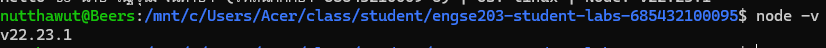
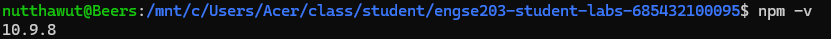
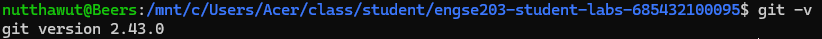

# Week 01 — Developer Environment & GitHub Setup

## Source

นำ source code จาก LAB 1 เดิมเข้า `source/` ด้วย:

```bash
npm run import:source -- week-01 /path/to/old-lab01
```

## Evidence ที่ควรมี

- ผล `node --version`, `npm --version`, `git --version`

## Node --version


## npm --version


## Git --version


- Screenshot โปรแกรม `hello.js`

Sorce code


- Original Repository URL และ Commit SHA
Original Repository URL: [https://github.com/Njuntaya/engse203-lab01--68543210009-5c3947fef0f8982851f625292118fe5fcfa23d65a](https://github.com/Njuntaya/engse203-lab01--68543210009-5c3947fef0f8982851f625292118fe5fcfa23d65a)

Commit SHA: c3947fef0f8982851f625292118fe5fcfa23d65a

- Reflection สั้น ๆ ว่าใช้ Git workflow อย่างไร
สำหรับ Git workflow ในแล็บนี้ เริ่มต้นจากการตั้งค่า Developer Environment ในเครื่อง จากนั้นทำการ git init เพื่อสร้าง Local Repository และทำการ Commit ตัว Source Code และหลักฐานการติดตั้งโปรแกรมต่าง ๆ เข้าไป จากนั้นจึงสร้าง Remote Repository บน GitHub แล้วทำการเชื่อมโยงโดยใช้คำสั่ง git remote add ก่อนจะ git push งานทั้งหมดขึ้นระบบ เพื่อเก็บบันทึกประวัติการทำงานอย่างเป็นระบบ


LAB 1 ไม่มี web application ได้ เมื่อ `publish/` ไม่มี `index.html` ระบบจะสร้าง evidence report จาก metadata ให้อัตโนมัติ
