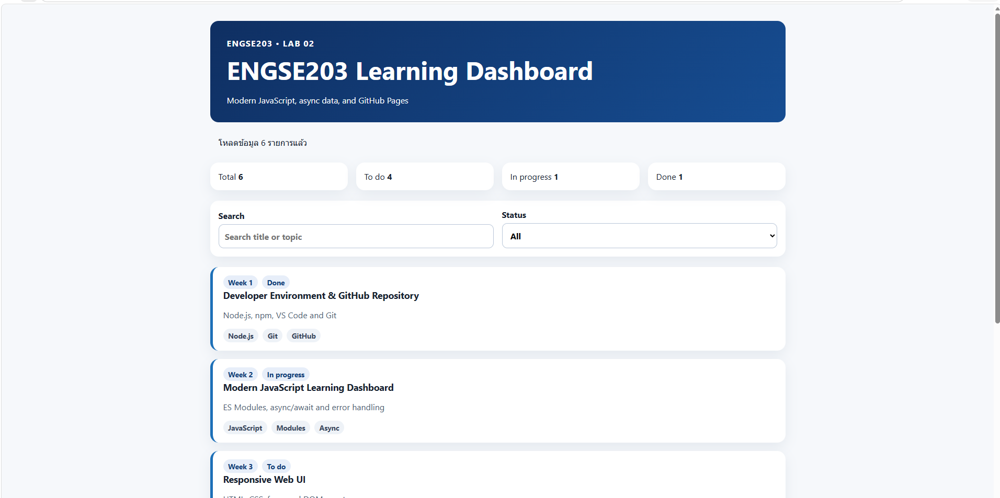
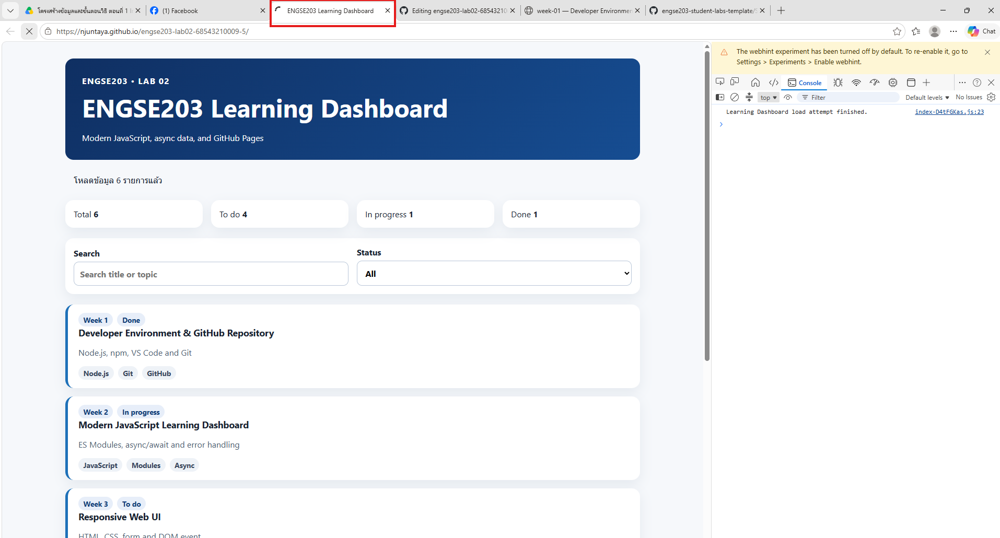
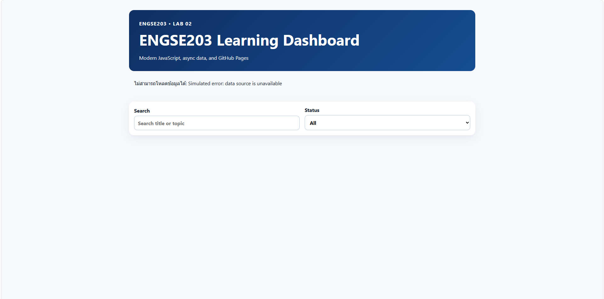
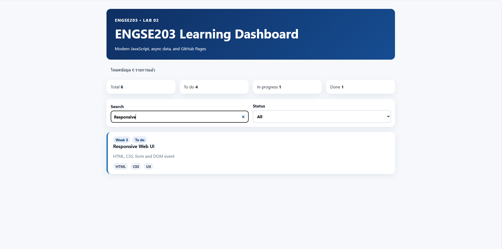
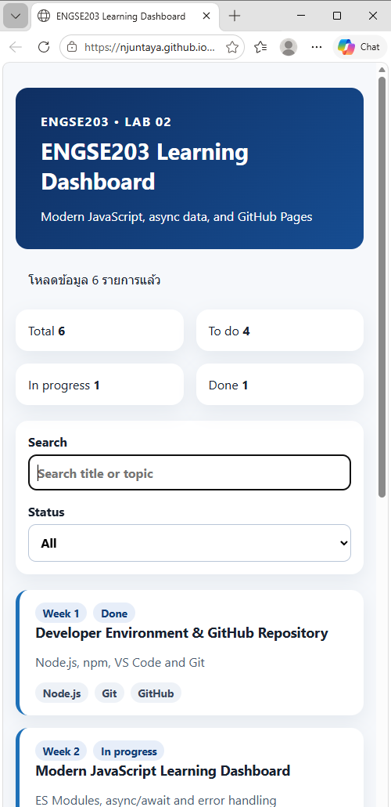
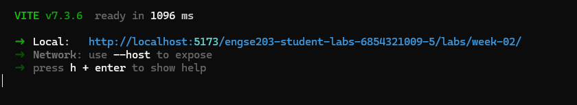
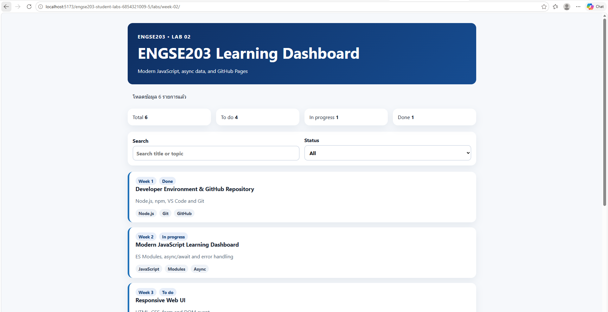
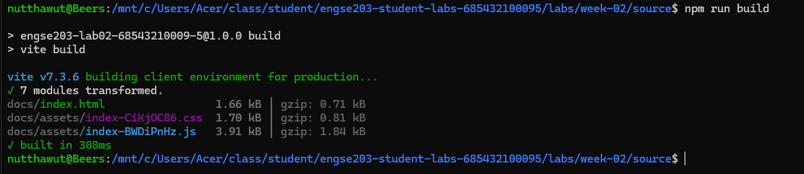

# Week 02 Evidence

ควรมี screenshots ของ initial/loading/success/error/filter/mobile และผล `npm run check` / `npm run build`

## # initial / success
หน้า Web UI เมื่อโหลดข้อมูลรายการสำเร็จและแสดงผลได้อย่างถูกต้อง

  

## # loading
หน้าจอระหว่างระบบกำลังดำเนินการโหลดข้อมูล (จำลอง Network ด้วย Slow 3G)

  

## # error state
หน้าจอแสดงผลเมื่อระบบเกิดข้อผิดพลาดในการดึงข้อมูล (API/JSON Error)

  

## # filter
การทดสอบฟังก์ชันค้นหา (Search) และการคัดกรองข้อมูลตามสถานะ (Status Filter)

  

## # mobile view
การแสดงผลในรูปแบบ Responsive Web Design บนหน้าจออุปกรณ์พกพา/มือถือ

  

---

## # ผลลัพธ์ npm run dev

หลักฐานการทดสอบรัน Local Development Server ด้วย Vite ในโฟลเดอร์ย่อย

### 1. ผลลัพธ์การพิมพ์คำสั่งผ่าน Terminal (Command Line)

  

### 2. หน้าจอผลลัพธ์การรันจริงบน Web Browser

  

---

## # ผลลัพธ์ npm run build
หลักฐานการคอมไพล์และสร้าง Production Build ลงในโฟลเดอร์ที่เตรียมส่งงาน

  

